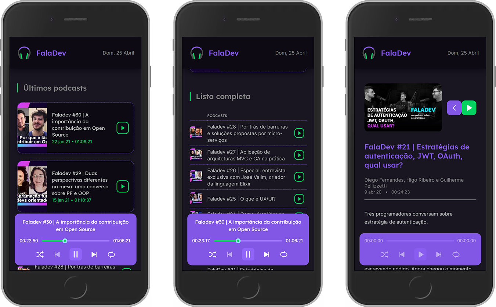

# Desafio NLW5 - 2021

Projeto desenvolvido durante a NLW5 em abriel de 2021.

Projeto em `NextJs`, `TypeScript`, `Sass`, `Framer Motion`, entre outras tecnologias.

 

## Home - desktop

 

## Detalhe do espisódio - desktop

 

## Home / player - mobile

 
 

Desenvolvido com ❤ por Marcelo Pereira.

Site: https://marcelopereira.dev/
 
Linkedin: https://linkedin.com/in/marcelopoars/
 
Canal Youtube: https://youtube.com/DicaDoNerd/
 
Instagram: https://instagram.com/DicaDoNerd/
